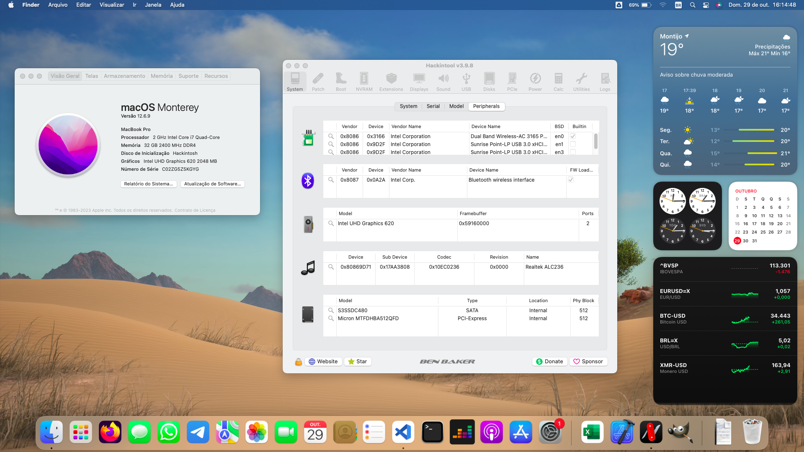

# EFI-Lenovo
Lenovo Ideapad 320S 14IKB (81BG Type) EFI

:information_source: **The current version is fully macOS compatible based on my laptop hardware.**
OpenCore, drivers, and kexts are always up to date!

:information_source: The EFI's have been tested on Moneterey.

 

:warning: **IMPORTANT**

This is not a guide, please refer to [Dortania](https://dortania.github.io/getting-started) before doing anything. I am not responsible for any damage. This OpenCore configuration is optimized for my specific hardware, so please use it only as a reference or if you happen to have the same or similar hardware.

 

    
## :computer: Hardware:

| **Category** | **Component**                         |
| ------------ | ------------------------------------- |
| **CPU**      | 1.80GHz Intel Core i5-8550U           |
| **GPU**      | Intel UHD 620                         |
| **RAM**      | 32GB (4GB non-removable) 2133MHz DDR4 |
| **SSD**      | 512GB PCIe SSD (Micron MTFDHBA512QFD) |
| **Display**  | 15,6" 1080p LCD non-touch display     |
| **Wi-Fi/BT** | Intel Dual Band Wireless-AC 3165 + BT |
| **Audio**    | Realtek ALC236 (layout-id=7)          |
| **Input**    | PS2 Keyboard & Synptics TrackPad      |

## :white_check_mark: Working:

- [x] CPU power management.
- [x] Graphics acceleration.
- [x] Battery read-out.
- [x] Keyboard & trackpad with all macOS gestures.
- [x] Wi-Fi.
- [x] Bluetooth.
- [x] USB ports.
- [x] HDMI video & audio output.
- [x] Ethernet.
- [x] Audio (Internal speakers, 3.5mm headphone jack).
- [x] Internal microphone.
- [x] VGA WebCam.
- [ ] AirDrop & Handoff.
- [x] iCloud & App Store.
- [x] iMessage & FaceTime.

## :x: Not working:

Only AirDrop and Handoff are not working since the Intel card are not fully compatible with macOS. To make these things works you need to replace with a native card one, like the Fenvi cards.

For Ethernet you can use USB Ethernets because this device does not have a Ethernet connector!

## NOTES

- When updated system for Ventura, Wi-Fi board leaves to work
- Sometime system changes date and time automaticly when longs time without use

## BIOS setup:

- Security / Intel Platform Trust Technology - Disabled
- Security / Intel SGX - Disabled
- Security / Secure Boot - Disabled
- Boot / Boot Mode - UEFI

## Credits:

[**Olarila**](https://www.olarila.com/)

[**Dortania**](https://dortania.github.io/getting-started/)

[**Milad Tahanian**](https://github.com/mtahanian) special credit for him and his help!
